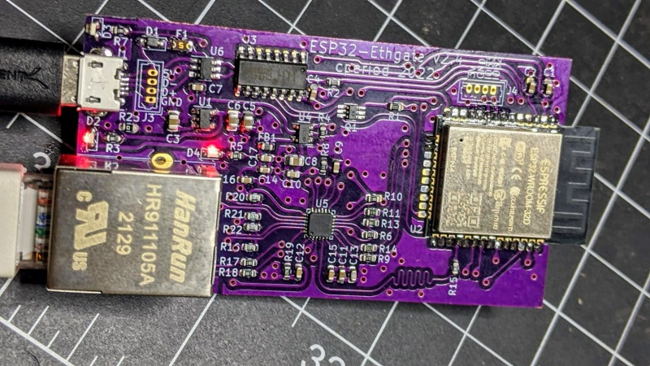

# ESP32-Ethgate

This is an ESP32 (ESP32-WROOM-32 module) with LAN8720A PHY project
intended to be an ESP-NOW to (wired) MQTT gateway.


It was designed to be produced in my PCB mill. If your PCB mill can handle
QFN24 footprints and double-sided PCB's then you might be able to duplicate
this. Or you can just order a PCB from pretty much anywhere.
[I had a few made by Oshpark](https://oshpark.com/shared_projects/fb9Y2JDP).




# Design

For simplicity, it uses the GPIO17 PLL clock technique rather than
the GPIO0-based crystal, and includes a second 3.3v regulator to control
the entire ethernet power rail independently. It needs stable USB power,
although at some point I might take a stab at a PoE version.

The CH340C runs off the first regulator along with the ESP32. The HT7233 is
rated for 300mA, which is just marginal for an ESP32, but so far I haven't
noticed any power issues (power consumption for the whole board averages
maybe 250mA). I've thrown in some USB ESD protection, a fuse,
and some reverse protection (I know that's not supposed to be a problem
with USB... things happen, don't ask). ESD protection for the Ethernet
port would be a nice-to-have at some point.

The CH340C supports the usual auto-programming. Note that you'll 
need to dial back the default upload baud rate.

I've added a small (1.25mm pitch) header with 3V3, GND, and two GPIO's
to allow for things like environmental sensors. Note that temperature
sensors will need to stay a minimum of 10cm off the board to avoid the heat
thrown by this board. I've also broken out the USB interface with a small
header because stuff... happened.

# BOM

Most of the components are from LCSC. There's an interactive BOM page
which should tell you what you need. Passives are 0603 with a few
0805 for the larger capacitors.

# Firmware

The Arduino-ESP32 ETH_LAN8720 sketch should work with the following
configuration:

```
#define LED_BUILTIN 2	// or use a NodeMCU-type of board definition
#define ETH_CLK_MODE    ETH_CLOCK_GPIO17_OUT
#define ETH_POWER_PIN   12
#define ETH_TYPE        ETH_PHY_LAN8720
#define ETH_ADDR        1
#define ETH_MDC_PIN     23
#define ETH_MDIO_PIN    18

ETH.begin(ETH_ADDR, ETH_POWER_PIN, ETH_MDC_PIN, ETH_MDIO_PIN,
	ETH_TYPE, ETH_CLK_MODE)
```

I flash mine with the ESP32 clock set at 80MHz, which seems to be
more stable at 100Mbps connection speeds and draws approximately 25%
less power.
