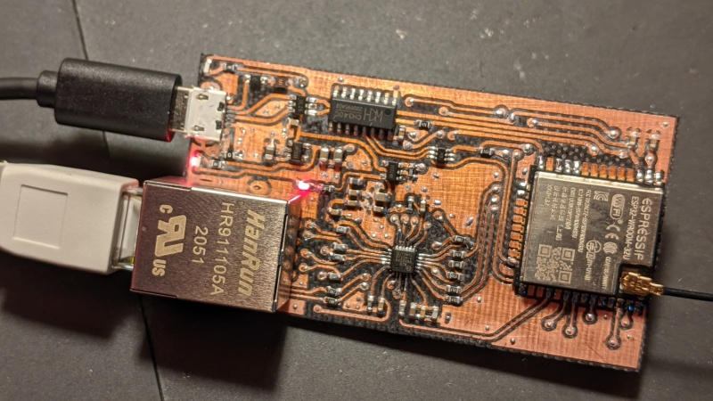

# ESP32-Ethgate

This is a basic ESP32 (ESP32-WROOM-32 module) with LAN8720A PHY project
intended to work mostly as an ESP-NOW to (wired) MQTT gateway. CH340C-based
USB is included.



It designed to be produced in my PCB mill. If your PCB mill can handle
QFN32 footprints and double-sided PCB's then you might be able to duplicate
this.

For simplicity, it uses the GPIO17 PLL clock technique rather than
the GPIO0-based crystal, and includes a second 3.3v regulator to control
the entire ethernet power rail independently. It still needs USB power,
although at some point I might take a stab at a PoE version.

The Arduino-ESP32 ETH_LAN8720 sketch should work with the following
configuration:

```
#define LED_BUILTIN 2	// or use a NodeMCU-type of board definition
#define ETH_CLK_MODE    ETH_CLOCK_GPIO17_OUT
#define ETH_POWER_PIN   12
#define ETH_TYPE        ETH_PHY_LAN8720
#define ETH_ADDR        1
#define ETH_MDC_PIN     23
#define ETH_MDIO_PIN    18

ETH.begin(ETH_ADDR, ETH_POWER_PIN, ETH_MDC_PIN, ETH_MDIO_PIN,
	ETH_TYPE, ETH_CLK_MODE)
```
